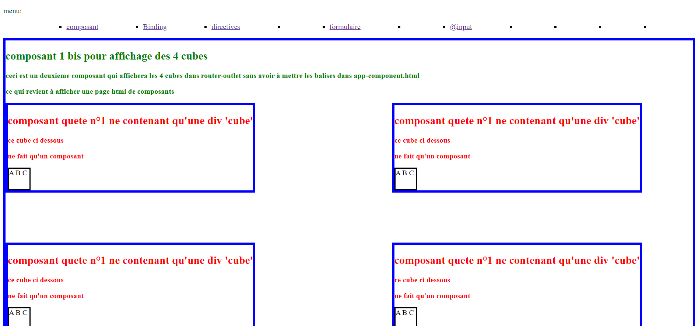
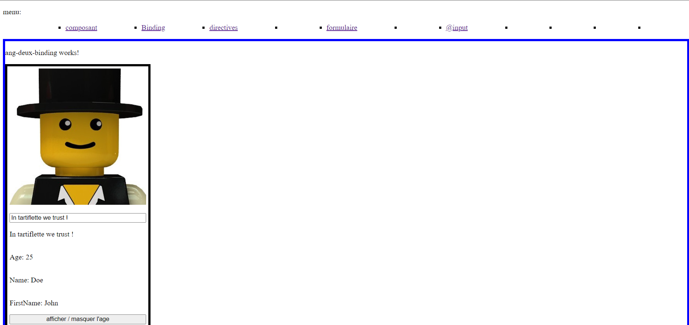
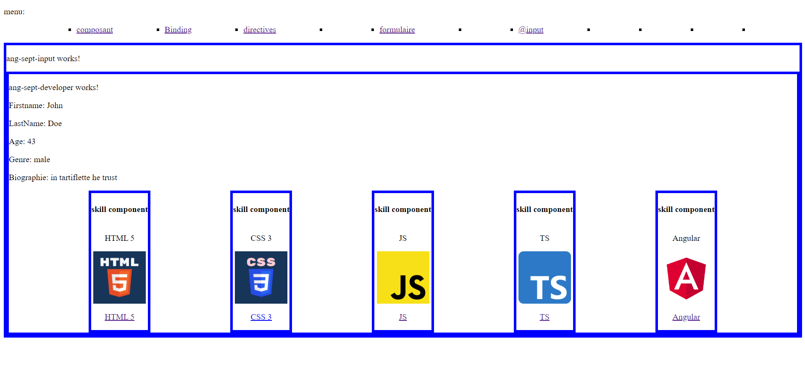

# ToutesQuetesAngular pour Correction :

Ce projet contient tout le code des quetes Angular dans un seul dossier.

pour Correction:

## quetes composant:

composants à inspecter:

- src/app/ang-un-composant
- src/app/ang-un-bis-affichage
  

## quetes binding:

composants à inspecter:

- src/app/ang-deux-bindig
  

## quetes directives:

(en cours)

## quetes router:

(en cours)

## quetes formulaire:

(en cours)

## quetes input:

composants à inspecter:

- src/app/ang-sept-developer
- src/app/ang-sept-skill
- src/app/ang-sept-input
- src/app/data >> developer.model.ts + skill.model.ts

