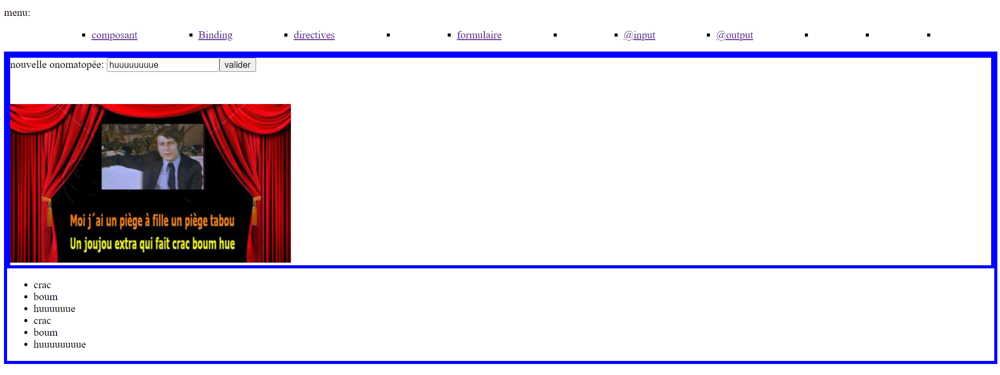

# ToutesQuetesAngular pour Correction :

Ce projet contient tout le code des quetes Angular dans un seul dossier.

pour Correction:

## quetes 1 composant:

composants à inspecter:

- src\app\ang-un-composant
- src\app\ang-un-bis-affichage
  

## quetes 2 binding:

composants à inspecter:

- src\app\ang-deux-binding
  

## quetes 3 directives:

- src\app\ang-trois-directives
  

## quetes 4 router:

(en cours)

## quetes 5 formulaire:

(en cours)

## quetes 7 input:

composants à inspecter:

- src\app\ang-sept-developer
- src\app\ang-sept-skill
- src\app\ang-sept-input
- src\models\developer.model.ts
- src\models\skill.model.ts

## quetes 8 output:

composants à inspecter:

- src\app\ang-huit-affichage
- src\app\ang-huit-create-onomatopia

## quetes 10 services:

composants à inspecter:

- src\app\ang-dix-cocktail-list
- src\app\ang-dix-services
- src\models\Cocktail.model.ts
- src\services\cocktail.service.ts
- src\app\tests\test.spec.ts

## quetes 11 services 2:

composants à inspecter:

- src\app\ang-onze-cocktail-list
- src\app\ang-onze-service-bis
- src\assets\cocktails.json
- src\services\cocktail2.service.ts

## quetes 12 services 3 - Nasa:

composants à inspecter:

- src\app\app-ang-douze-nasa
- src\services\nasa.service.ts

